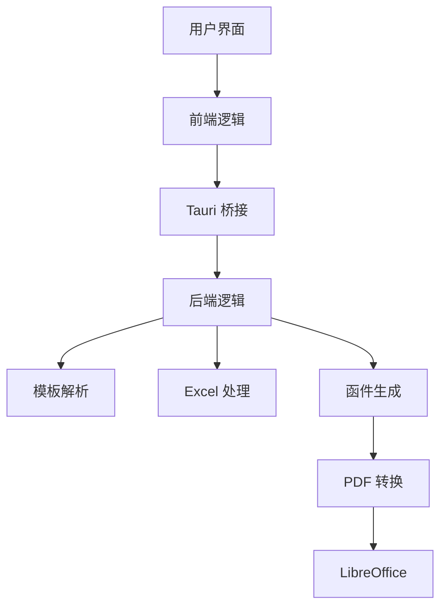

# 函件生成器 (Letter Generator) Code Wiki

## 1. 项目概述

函件生成器是一个基于 Tauri 的跨平台桌面应用，用于根据 Word 模板和 Excel 数据源批量生成函件，并支持导出为 PDF 格式。

**主要功能：**
- 解析 Word 模板中的占位符
- 读取 Excel 数据源
- 配置关键词映射规则
- 批量生成函件
- 导出为 PDF 格式

**技术栈：**
- 前端：React + TypeScript + Vite
- 后端：Rust + Tauri
- 外部依赖：LibreOffice (用于 PDF 转换)

## 2. 项目结构

### 2.1 目录结构

```
├── src/                # 前端源代码
│   ├── lib/            # 类型定义
│   ├── App.tsx         # 主应用组件
│   ├── main.tsx        # 入口文件
│   └── styles.css      # 样式文件
├── src-tauri/          # 后端源代码 (Rust)
│   ├── resources/      # 资源文件
│   │   └── libreoffice/ # LibreOffice 组件
│   ├── src/            # Rust 源代码
│   │   ├── error.rs    # 错误处理
│   │   ├── excel.rs    # Excel 处理
│   │   ├── generation.rs # 函件生成
│   │   ├── lib.rs      # 主库文件
│   │   ├── models.rs   # 数据模型
│   │   ├── settings.rs # 设置管理
│   │   └── template.rs # 模板处理
│   ├── Cargo.toml      # Rust 依赖配置
│   └── build.rs        # 构建脚本
├── package.json        # 前端依赖配置
├── index.html          # 前端入口 HTML
└── README.md           # 项目说明
```

### 2.2 核心文件说明

| 文件路径 | 主要职责 | 说明 |
|---------|---------|------|
| [src/App.tsx](file:///Users/chen/Documents/Playground/payment/src/App.tsx) | 前端主组件 | 实现用户界面和交互逻辑 |
| [src/lib/types.ts](file:///Users/chen/Documents/Playground/payment/src/lib/types.ts) | 前端类型定义 | 定义应用中使用的各种数据类型 |
| [src-tauri/src/lib.rs](file:///Users/chen/Documents/Playground/payment/src-tauri/src/lib.rs) | 后端主库 | 提供 Tauri 命令和应用配置 |
| [src-tauri/src/generation.rs](file:///Users/chen/Documents/Playground/payment/src-tauri/src/generation.rs) | 函件生成逻辑 | 实现函件生成和 PDF 转换 |
| [src-tauri/src/template.rs](file:///Users/chen/Documents/Playground/payment/src-tauri/src/template.rs) | 模板处理 | 解析 Word 模板中的占位符 |
| [src-tauri/src/excel.rs](file:///Users/chen/Documents/Playground/payment/src-tauri/src/excel.rs) | Excel 处理 | 读取和解析 Excel 数据源 |

## 3. 系统架构

### 3.1 架构图



### 3.2 核心流程

1. **模板导入**：用户选择 Word 模板文件，系统解析其中的占位符
2. **数据导入**：用户选择 Excel 数据源，系统读取工作表和数据
3. **映射配置**：用户配置模板占位符与数据源的映射关系
4. **预览生成**：系统根据配置预览生成结果
5. **函件生成**：系统批量生成函件并导出
6. **PDF 转换**：如果需要，系统使用 LibreOffice 将生成的 Word 文档转换为 PDF

## 4. 主要模块

### 4.1 前端模块

#### 4.1.1 主应用组件 (App.tsx)

**功能**：实现用户界面和交互逻辑，包括四个主要步骤：
- 模板导入
- 数据导入
- 映射配置
- 函件生成

**核心方法**：
- `chooseTemplate()`: 选择 Word 模板并解析
- `chooseExcel()`: 选择 Excel 数据源并解析
- `runPreview()`: 预览生成结果
- `generateLetters()`: 生成函件

#### 4.1.2 类型定义 (types.ts)

**功能**：定义应用中使用的各种数据类型，包括：
- 模板检查结果
- Excel 检查结果
- 占位符绑定
- 生成规则
- 生成结果

### 4.2 后端模块

#### 4.2.1 主库 (lib.rs)

**功能**：提供 Tauri 命令和应用配置，包括：
- 模板解析命令
- Excel 解析命令
- 设置管理命令
- 预览生成命令
- 函件生成命令
- 打开输出目录命令

#### 4.2.2 函件生成 (generation.rs)

**功能**：实现函件生成和 PDF 转换逻辑，包括：
- 构建分组数据
- 解析占位符
- 生成 Word 文档
- 转换为 PDF

**核心方法**：
- `preview_generation()`: 预览生成结果
- `generate_letters()`: 生成函件
- `convert_to_pdf()`: 将 Word 文档转换为 PDF

#### 4.2.3 模板处理 (template.rs)

**功能**：解析 Word 模板中的占位符，支持两种语法：
- `{{占位符}}` (双花括号语法)
- `%占位符%` (百分号语法)

#### 4.2.4 Excel 处理 (excel.rs)

**功能**：读取和解析 Excel 数据源，包括：
- 读取工作表
- 读取列名
- 读取预览数据

## 5. 关键类与函数

### 5.1 前端关键函数

| 函数名 | 功能 | 参数 | 返回值 |
|-------|------|------|-------|
| `chooseTemplate()` | 选择 Word 模板并解析 | 无 | Promise<void> |
| `chooseExcel()` | 选择 Excel 数据源并解析 | 无 | Promise<void> |
| `runPreview()` | 预览生成结果 | 无 | Promise<void> |
| `generateLetters()` | 生成函件 | 无 | Promise<void> |
| `persistSettings()` | 保存应用设置 | settings: AppSettings | Promise<void> |

### 5.2 后端关键函数

| 函数名 | 功能 | 参数 | 返回值 |
|-------|------|------|-------|
| `inspect_word_template()` | 解析 Word 模板中的占位符 | template_path: String | Result<TemplateInspectionResult, String> |
| `inspect_excel_source()` | 解析 Excel 数据源 | file_path: String | Result<ExcelInspectionResult, String> |
| `preview_generation()` | 预览生成结果 | template_path, file_path, bindings, rule | Result<GenerationPreview, String> |
| `generate_letters()` | 生成函件 | resource_dir, settings, template_path, file_path, bindings, rule | Result<GenerationResult, String> |
| `convert_to_pdf()` | 将 Word 文档转换为 PDF | resource_dir, target_docx, output_dir | Result<(), AppError> |

## 6. 数据模型

### 6.1 前端数据模型

| 模型名称 | 描述 | 字段 |
|---------|------|------|
| `TemplateInspectionResult` | 模板检查结果 | templatePath: string, placeholders: string[], placeholderSyntaxes: PlaceholderSyntax[] |
| `ExcelInspectionResult` | Excel 检查结果 | filePath: string, sheets: string[], columns: string[], previewRows: Record<string, string>[] |
| `PlaceholderBinding` | 占位符绑定 | placeholder: string, sourceType: BindingSourceType, sourceValue: string |
| `GenerationRule` | 生成规则 | mode: GenerationMode, sheetName: string, groupByFields: string[], sumFields: string[], startNumber: number, letterNumberTemplate: string, fileNameTemplate: string, dateValue: string, exportPdf: boolean, outputDir?: string |
| `GenerationPreview` | 生成预览 | totalInputRows: number, totalLetters: number, sampleFileName: string, missingBindings: string[] |
| `GenerationResult` | 生成结果 | totalInputRows: number, totalLetters: number, docxSuccessCount: number, pdfSuccessCount: number, failures: GenerationFailure[], outputDir: string |

### 6.2 后端数据模型

| 模型名称 | 描述 | 字段 |
|---------|------|------|
| `AppSettings` | 应用设置 | helpWidgetPinned: bool, helpWidgetCollapsed: bool, recentTemplatePaths: Vec<String>, recentDataSourcePaths: Vec<String>, bankMappings: Vec<BankMapping> |
| `BankMapping` | 银行映射 | key: String, accountName: String, accountNumber: String, bankName: String |
| `GenerationFailure` | 生成失败 | target: String, reason: String |

## 7. 依赖关系

### 7.1 前端依赖

| 依赖 | 版本 | 用途 |
|-----|------|------|
| react | ^18.3.1 | 前端框架 |
| react-dom | ^18.3.1 | React DOM 操作 |
| @tauri-apps/api | ^2.2.0 | Tauri API 调用 |
| @tauri-apps/plugin-dialog | ^2.2.0 | 文件选择对话框 |
| @tauri-apps/plugin-opener | ^2.2.0 | 打开文件/目录 |
| framer-motion | ^12.6.0 | 动画效果 |
| typescript | ~5.7.2 | 类型检查 |
| vite | ^6.0.3 | 构建工具 |

### 7.2 后端依赖

| 依赖 | 版本 | 用途 |
|-----|------|------|
| tauri | ^2.2.5 | 桌面应用框架 |
| anyhow | 1.0.95 | 错误处理 |
| calamine | 0.26.1 | Excel 解析 |
| chrono | 0.4.39 | 日期时间处理 |
| dirs | 5.0.1 | 目录操作 |
| open | 5.3.2 | 打开文件/目录 |
| regex | 1.11.1 | 正则表达式 |
| serde | 1.0.217 | 序列化/反序列化 |
| serde_json | 1.0.138 | JSON 处理 |
| thiserror | 2.0.11 | 错误处理 |
| walkdir | 2.5.0 | 目录遍历 |
| zip | 2.2.2 | ZIP 文件处理 |

## 8. 项目运行方式

### 8.1 开发模式

1. 安装依赖：
   ```bash
   npm install
   ```

2. 启动开发服务器：
   ```bash
   npm run dev
   ```

### 8.2 构建应用

1. 构建前端：
   ```bash
   npm run build
   ```

2. 构建 Tauri 应用：
   ```bash
   npm run tauri build
   ```

### 8.3 运行应用

构建完成后，应用会生成在 `src-tauri/target` 目录中，可直接运行。

## 9. 使用指南

### 9.1 基本流程

1. **导入模板**：点击 "选择 .docx 函件模板" 按钮，选择 Word 模板文件
2. **导入数据**：点击 "选择 .xlsx 或 .xls 文件" 按钮，选择 Excel 数据源
3. **配置映射**：为模板中的每个占位符选择数据源（Excel 列、系统变量、固定文本或配置映射值）
4. **预览结果**：点击 "预览生成结果" 按钮，查看预计生成的函件数量和文件名示例
5. **生成函件**：点击 "开始生成函件" 按钮，生成函件并导出

### 9.2 高级功能

- **分组生成**：按指定字段分组生成函件，支持求和计算
- **自定义函号**：使用函号模板自定义函件编号
- **自定义文件名**：使用文件名模板自定义生成的文件名
- **PDF 导出**：勾选 "导出 PDF" 选项，将生成的 Word 文档转换为 PDF
- **自定义输出目录**：点击 "选择导出目录" 按钮，自定义函件导出位置

## 10. 常见问题与解决方案

### 10.1 模板解析问题

**问题**：模板中的占位符未被识别
**解决方案**：确保占位符使用正确的语法（`{{占位符}}` 或 `%占位符%`）

### 10.2 Excel 解析问题

**问题**：Excel 文件无法解析
**解决方案**：确保 Excel 文件格式正确，且工作表名称正确

### 10.3 PDF 转换问题

**问题**：PDF 转换失败
**解决方案**：确保 LibreOffice 组件存在且可用，检查 Word 文档是否有特殊格式导致转换失败

### 10.4 生成失败

**问题**：函件生成失败
**解决方案**：检查映射配置是否完整，确保所有占位符都已绑定数据源

## 11. 扩展与定制

### 11.1 添加新的系统变量

在前端 `App.tsx` 文件中，修改 `systemOptions` 数组，添加新的系统变量：

```typescript
const systemOptions = ["函号", "日期", "当前年份", "序号", "新变量"];
```

在后端 `generation.rs` 文件中，修改 `resolve_replacements` 函数，添加新的系统变量处理：

```rust
values.insert("新变量".into(), "新变量值".into());
```

### 11.2 添加新的配置映射值

在前端 `App.tsx` 文件中，修改 `configOptions` 数组，添加新的配置映射值：

```typescript
const configOptions = ["户名", "账号", "开户行", "新配置"];
```

在后端 `generation.rs` 文件中，修改 `config_value` 函数，添加新的配置映射值处理：

```rust
match (found, field) {
    (Some(mapping), "户名") => mapping.account_name.clone(),
    (Some(mapping), "账号") => mapping.account_number.clone(),
    (Some(mapping), "开户行") => mapping.bank_name.clone(),
    (Some(mapping), "新配置") => mapping.new_config.clone(),
    _ => String::new(),
}
```

### 11.3 自定义生成模式

在前端 `types.ts` 文件中，修改 `GenerationMode` 类型，添加新的生成模式：

```typescript
export type GenerationMode = "row" | "grouped" | "new_mode";
```

在后端 `generation.rs` 文件中，修改 `build_grouped_rows` 函数，添加新的生成模式处理：

```rust
match rule.mode {
    GenerationMode::Row => rows.to_vec(),
    GenerationMode::Grouped => {
        // 现有分组逻辑
    },
    GenerationMode::NewMode => {
        // 新的生成模式逻辑
    },
}
```

## 12. 总结

函件生成器是一个功能强大的跨平台桌面应用，使用 React + TypeScript + Rust + Tauri 技术栈，能够根据 Word 模板和 Excel 数据源批量生成函件，并支持导出为 PDF 格式。

**核心优势：**
- 跨平台：支持 Windows、macOS 和 Linux
- 高效：使用 Rust 实现后端逻辑，性能优异
- 灵活：支持多种数据源和生成模式
- 易用：直观的用户界面和操作流程
- 功能完整：从模板解析到 PDF 转换的全流程支持

该应用适用于需要批量生成函件的场景，如财务函件、通知函件等，能够大大提高工作效率。